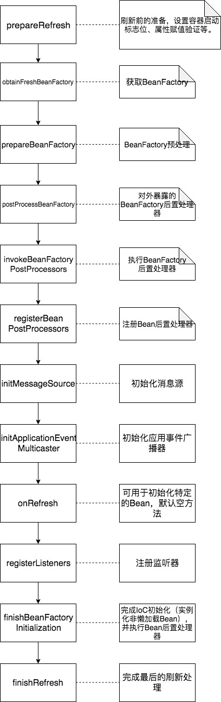
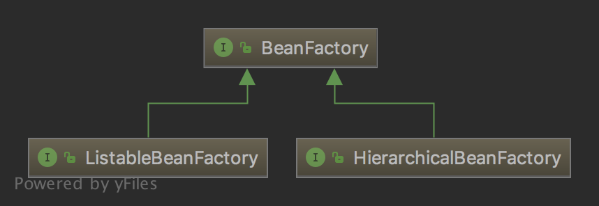
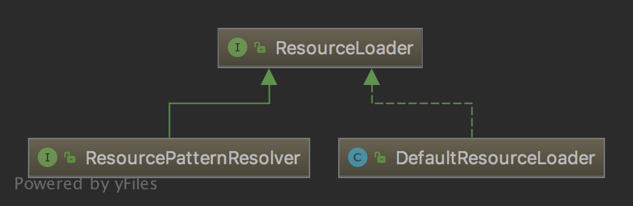
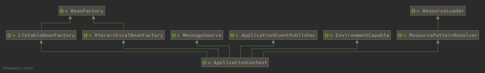

# Spring IoC容器初始化过程

面对Spring中复杂的对象继承、引用无从下手？面对Spring庞大的源码即使使用**小黄鸭调试法**也无济于事？这次，我试着不那么枯燥的讲解Spring源码。

这是Spring IoC容器初始化过程，```refresh```方法，可以说是Spring中最为核心的方法。




我并不打算从这个方法执行开始讲起，因为这会让任何刚接触Spring源码的人都一头雾水。

首先抛出几个问题：

- **Spring的核心功能是什么？**

当然IoC和AOP了。IoC能让我们脱离相互依赖的对象，使得我们更加关注业务逻辑，代码耦合度降低便于测试。更加直白地讲，是在代码中，我们不再手动new一个对象，而是Spring为我们准备好，我们只需从“IoC容器中get”。

- **如何实现一个IoC容器？**

觉得这个问题来得有点抖？上一个问题问是什么，这一个问题就问怎么做。其实仔细思考，是能回答出这个问题的。

我们把IoC容器想象的简单一点，说是控制反转，其实不就是别人把我们要用的对象实例化，放到一个缓存中，我们直接从缓存中拿么？

这个过程涉及2个非常粗糙的方面：

1. 通过配置文件（或者注解）定义哪些对象需要交给IoC容器（称为Bean），这个配置文件就需要解析——ResourceLoader，资源加载类。
2. 定义Bean对象的访问接口，通过这个接口可以将实例化的对象放进去、取出来——BeanFactory，Bean工厂，IoC容器。

这是```ClassPathXmlApplicationContext```的类继承结构，我们将从这张图开始进入Spring的源码世界。


**BeanFactory**

```BeanFactory```是IoC容器的根接口，它只提供了最最基本的功能，包括根据类名获取实例对象、是否是单例对象等。



```BeanFactory```接口衍生出了```ListableBeanFactory```和```HierarchicalBeanFactory```两个接口，其中```ListableBeanFactory```提供了返回容器中的Bean对象功能，```HierarchicalBeanFactory```提供了访问父容器的功能。

<div style="font-family:楷体;background-color:#F5F6F7">在Spring IoC容器的接口设计中，充分体现了设计模式原则中的<strong>接口隔离原则</strong>，将接口的功能尽量的做到了最小粒度的隔离。</div>
最后```ApplicationContext```接口同时继承了这两种Bean工厂。

- **这里留下一个疑问，在上述三个FactoryBean中，为什么都只包含了读方法，而没有写方法？（例如HierarchicalBeanFactory有获取父容器的方法，但是没有设置父容器的方法。）**

**ResourceLoader**

Spring把所有的资源都抽象成了```Resource```接口，```ResourceLoader```被设计用于加载```Resource```资源文件。



```ResourceLoader```接口衍生出了```ResourcePatternResolver```接口和```DefaultResourceLoader```类，其中```ResourcePatternResolver```接口提供了对资源路径的通配符匹配，新增```getResources```方法返回```Resource```数组，```DefaultResourceLoader```则是资源加载的默认实现类。

最后```ApplicationContext```接口实现了```ResourcePatternResolver```接口，而```DefaultResourceLoader```则由```ApplicationContext```的子类```AbstractApplicationContext```继承。

<div style="font-family:楷体;background-color:#F5F6F7">
  本段将介绍Spring的Resource接口设计，可直接跳过此段。</p>
  在Spring Resource接口设计中，运用了设计模式中的<strong>策略模式</strong>，Resource接口抽象了资源访问的逻辑，衍生出了FileSystemResource等具体的策略，ResourceLoader返回一个Resource实例，而Spring中的ApplicationContext则充当了策略模式中的Context，也就是策略模式的决策者。</p>
  接下来将会把Resource策略模式从Spring中剥离出来，便于我们更加详尽的分析，
</div>

**ApplicationContext**

```ApplicationContext```是```BeanFactory```的子接口，前面说到```BeanFactory```在Spring中作为IoC容器，提供了最基本的功能，而```ApplicationContext```同样可以作为Spring IoC容器，具备更加完善的功能。



可以看到```ApplicationContext```继承了这么多接口，足以说明它具备了强大的能力，包括前面提到的```BeanFactory```的两个子接口和```ResourceLoader```的子接口，接下来看看其他接口都有什么能力。

MessageSource：在Spring中要支持国际化，可以通过```MessageSource```实现。它的一个子接口```HierachicalMessageSource```采用了和```BeanFactory```的子接口```HierarchicalBeanFactory```一样的设计，提供了父子层级的MessageSource。

ApplicationEventPublisher：事件发布，在IoC容器的初始化过程中会调用```initApplicationEventMulticaster()```方法初始化事件，接着会注册监听器。在Spring中实现```ApplicationEvent```接口，即可定义一个事件。具体事件是如何被Spring发布以及监听在后面会有详细的分析过程。

EnvironmentCable：用于获取当前环境。

本章我们暂且分析到这里，管中窥豹，对Spring的IoC容器有一个大致的了解。我相信仍然充满许多疑问，但不可否认的是，我们从Spring的类结构设计可以说是很值得学习的。


