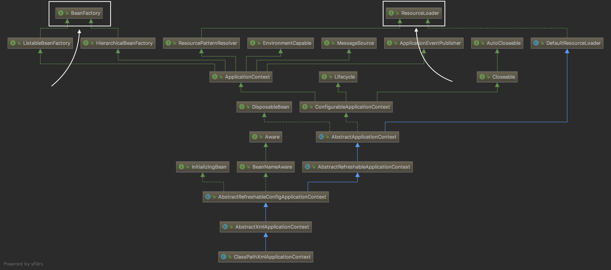

# IoC容器

上一章我们**从上至下**对Spring的IoC做了简要解读，本章我们将**从下至上**来个胜利大会师。

```ClassPathXmlApplicationContext ctx = new ClassPathXmlApplicationContext("applicationContext.xml")```

通过这句话我们就能在应用中初始化IoC容器和在IoC容器中实例化Bean对象。我们不妨再来看看第一章的类继承结构图。



上一章我们从上至下解读到了```ApplicationContext```接口，知道了它是一个功能强大的IoC容器，这次我们从```ClassPathXmlApplicationContext```从下至上抽丝剥茧，去除一些“不重要”的继承关系。