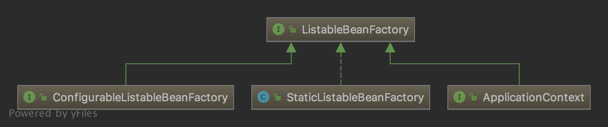

# BeanFactory与ApplicationContext

```BeanFactory```是Spring中最基本的IoC容器，它具备最基本的功能。```ApplicationContext```则是更为高级的IoC容器，它支持国际化、事件发布等。通常我们所使用的```ClassPathXmlApplicationContext```等都间接继承自```ApplicationContext```。

BeanFactory接口只定义如何访问容 器内管理的Bean的方法，各个BeanFactory的具体实现类负责具体Bean的注册以及管理工作。 BeanDefinitionRegistry接口定义抽象了Bean的注册逻辑

## BeanFactory

尽管我们通常使用```ApplicationContext```衍生出的IoC高级容器，但```BeanFactory```毕竟是Spring中最基本的IoC容器，也提供了IoC容器的实现子类。


▲这是```BeanFactory```的继承机构图，接下来我们将抽丝剥茧，解读Spring中```BeanFactory```的源码。


▲这是从```BeanFactory```直接继承的接口和类。

### [I]ListableBeanFactory

对```BeanFactory```扩展了获取全部Bean的方法，取名为List也蕴含了可以对Bean进行枚举获取。

```ListableBeanFactory```的子类继承关系就稍微要复杂一点了，它直接的子类一共有3个：



**ConfigurableListableFactoryBean**


▲可以看到```ConfigurableListableBeanFactory```不仅仅是扩展了```ListableBeanFactory```，它几乎扩展了```BeanFactory```所有子接口。由此可见，这个接口一定不简单。它自身扩展了几个方法，其中包括单例预加载等。

**StaticListableBeanFactory**

```StaticListableBeanFactory```是一个完整的实现类，到目前为止，除了```SimpleJndiBeanFactroy```以外，这是第二个实现类，它的继承结构也很简单，直接实现```ListableBeanFactory```接口，我们来解读下这个IoC容器所具备什么样的功能。

**【解读时刻】**

字段属性：

```private final Map<String, Object> beans		//用于存放Bean实例对象，例如getBean，通过key值获取实例对象。```

构造方法：

```
public StaticListableBeanFactory() {
   this.beans = new LinkedHashMap<String, Object>();	//实例化beans字段属性，还有一个有参构造方法，可以传入一个Map对象。
}
```

普通方法：

_StaticListableBeanFactory直接继承自ListableBeanFactory，间接继承自BeanFactory，这两个接口都只包含了实例对象读相关的方法_

```
public void addBean(String name, Object bean) {
   this.beans.put(name, bean);		//将实例化对象直接放入Map中。
}
```

```
@Override
public Object getBean(String name) throws BeansException {
   //这是实现的BeanFactory的方法，这个方法也非常简单，它只能获取beans字段中存在的对象实例，也就是说它并不会去主动创建Bean实例。这也实际上是StaticListableBeanFactory的特点，它不会去加载任何的Bean对象，如果直接使用它作为IoC容器，它实际上就是封装了一个Map。
}
```

测试程序：

<!-- 代码仓库 -->

**ApplicationContext**

前面已经提到过，它直接扩展了```BeanFactory```两个子接口：```ListableBeanFactory```和```HierarchicalBeanFactory```，使它成为了更为高级的IoC容器（当然它还扩展了其他接口）。


### [C]SimpleJndiBeanFactory

<!-- TODO JNDI以及如何进行单元测试 -->

### [I]AutowireCapableBeanFactory

```AutowireCapableBeanFactory```在```BeanFactory```的基础上扩展了对Bean实例的管理，例如：手动创建Bean、手动初始化Bean、执行Bean的后置处理器等。


▲可以看到```AutowireCapableBeanFactory```接口有两个直接子类，其中一个```ConfigurableListableBeanFactory```前面提到它几乎扩展了所有的```BeanFactory```子接口，另外一个```AbstractAutowireCapableBeanFactory```则是它的抽象类，这个类的信息量就很大了，因为它同样不只是继承了```AutowireCapableBeanFactory```。

### [I]HierarchicalBeanFactory

```HierarchicalBeanFactory```提供了访问父容器的功能。


